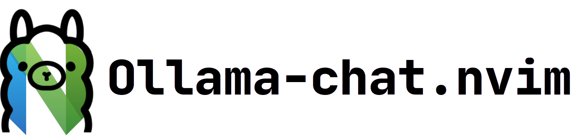

> Chat with Ollama models directly in a Neovim buffer!

## Features

This is a simple plugin that allows you to chat with Ollama models:
- no UI to get in the way - the chat works in a normal Neovim buffer, 
- chat history is completely modifiable - the whole conversation is sent to the model with each new prompt,
- populate new chat buffer with text/code selection.


## Usage

This plugin adds the `OllamaCreateChat` command that opens a new chat buffer. The buffer is populated with a base prompt and is modifiable. If there is a selection active it is copied in the new chat buffer as text, or within a corresponding code block if the source file type is code.
The Ollama model can then be prompted with the chat buffer via two new prompts `Chat` and `Chat Code`, both of which send the entire buffer to the Ollama server, the difference being that `Chat Code` uses the model `model_code` set in the `opts` table.

## Install

First you need [Ollama](https://ollama.ai/) installed as per their instructions.

To use the plugin with `lazy.nvim` you can add the file `lua/plugins/ollama-chat.lua`:

```lua
return {
  "gerazov/ollama-chat.nvim",
  dependencies = {
    "nvim-lua/plenary.nvim",
    "stevearc/dressing.nvim",
  },

  -- lazy load on command
  cmd = {
      "OllamaCreateChat",
      "OllamaChat",
      "OllamaChatCode",
      "OllamaModel",
      "OllamaServe",
      "OllamaServeStop"
  },

  keys = {
    {
      "<leader>occ",
      function() require('ollama-chat.chat').create_chat() end,
      desc = "Create Ollama Chat",
      mode = { "n", "x" },
      silent = true,
    },
    {
      "<leader>och",
      function() require('ollama-chat.chat').prompt('Chat') end,
      desc = "Chat",
      mode = { "n" },
      silent = true,
    },
    {
      "<leader>ocd",
      function() require('ollama-chat.chat').prompt('Chat_code') end,
      desc = "Chat Code",
      mode = { "n" },
      silent = true,
    },
  },

  opts = {
      model = "openhermes2-mistral",
      model_code = "codellama",
      url = "http://127.0.0.1:11434",
      serve = {
        on_start = false,
        command = "ollama",
        args = { "serve" },
        stop_command = "pkill",
        stop_args = { "-SIGTERM", "ollama" },
      },
    }
```

## References

- [Ollama](https://ollama.ai/)
- communication with Ollama is based on [ollama.nvim](https://github.com/nomnivore/ollama.nvim)

## Similar plugins

- [model.nvim](https://github.com/gsuuon/model.nvim)
- [ollama.nvim](https://github.com/nomnivore/ollama.nvim)
- [gen.nvim](https://github.com/David-Kunz/gen.nvim)
- [nvim-llama](https://github.com/jpmcb/nvim-llama)
